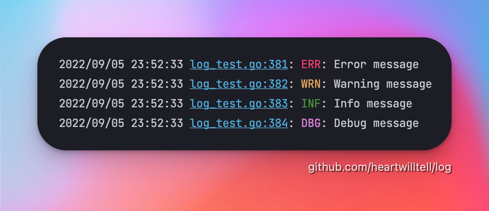

# `log` - Simple leveled logging based on standard log package

<p align="center">
  
</p>

## Documentation
[](https://goreportcard.com/report/github.com/heartwilltell/log)
[](https://pkg.go.dev/github.com/heartwilltell/log)
[](https://github.com/heartwilltell/log/actions/workflows/pr.yml)

## Benefits

- 😻 Leveled logging
- 😚 Simple API
- 🤝 `fmt` friendly
- 👌 Zero dependencies
- 😮‍💨 No global logger
- 👏 No structured logging bullshit


## Installation
```bash
go get github.com/heartwilltell/log
```

## Leveled logging

The `StdLog` implements a simple interface:
```go
// Logger formats the message according to standard format specifiers from the fmt package
// and writes the message to writer specified by the concrete interface implementation.
type Logger interface {
	// Error formats and writes the error level message.
	Error(format string, v ...any)
	// Warning formats and writes the warning level message.
	Warning(format string, v ...any)
	// Info formats and writes the information level message.
	Info(format string, v ...any)
	// Debug formats and writes the debug level message.
	Debug(format string, v ...any)
}
```

## Usage

👇 The usage is pretty simple. Just create a logger instance and call any of leveled methods.
```go
logger := log.New()
logger.Info("Listen on port: %d", 8080)
```
###

👇 Sets the logging level to `debug` level.
```go
logger := log.New(log.WithLevel(log.DBG))
```
###

👇 Parses string to level and creates logger with `warning` level.
```go
level, levelErr := log.ParseLevel("warning")
if levelErr != nil {
	// handle error here
}

logger := log.New(log.WithLevel(level))
```
###

👇 Creates logger with different `io.Writer`.
```go
var w bytes.Buffer 

logger := log.New(log.WithWriter(w))
```
###

👇 Disables the colorful output.
```go
logger := log.New(log.WithNoColor())
```
###

👇 Sets the UTC time format.
```go
logger := log.New(log.WithUTC())
```
###

👇 Enables printing the code line number.
```go
// Short format:
// INF: 2022/07/08 11:22:30 server.go:111: message
logger := log.New(log.WithLineNum(log.ShortFmt))
```
OR
```go
// Long format:
// INF: 2022/07/08 11:22:30 /Users/heartwilltell/Go/app/server.go:111: message
logger := log.New(log.WithLineNum(log.LongFmt))
```
###

👇 Sets the level mark at the end of log prefix.
```go
logger := log.New(log.WithLevelAtPrefixEnd())
```
Will produce this 👇
```
// 2022/07/08 11:22:30 INF: message
```
Instead of this 👇
```
// INF: 2022/07/08 11:22:30: message
```

###

👇 Creates nop logger which implements `log.Logger` interface.
```go
logger := log.NewNopLog()
```
💡 _Useful for tests or places where logger should be disabled by default_

## License
[MIT License](LICENSE).